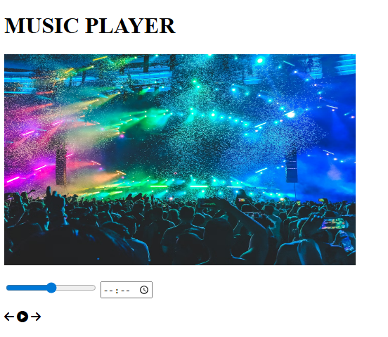

#  Music Player (HTML UI)

A simple **Music Player UI** built using **HTML** and **Font Awesome icons**.
This project focuses on the **visual layout** of a music player rather than full audio functionality.

---

##  Features

* 🎶 Music player layout
* 🖼️ Album cover image
* ⏳ Progress bar (range input)
* ⏱️ Time input display
* ⏮️ Previous, ▶️ Play, ⏭️ Next controls using Font Awesome icons
* 📱 Responsive meta tag included

---

##  Technologies Used

* **HTML5**
* **Font Awesome 6.5.1** (for player icons)
* **Unsplash** (for album image)

---




##  Project Structure

```
music-player/
│
├── Project2.html
└── README.md
```

---

##  How to Run

1. Download or clone the repository
2. Open `index.html` in any modern web browser
3. Enjoy the UI 🎧

---

##  Notes
* This project is **UI-only** and does **not** play actual music.
* JavaScript can be added later to:

  * Play/pause audio
  * Update progress bar
  * Handle next/previous track actions

---

##  Future Improvements

* Add `<audio>` element with JavaScript controls
* Style the player using CSS
* Create a playlist feature
* Make controls functional

---

##  Preview

The player displays:

* A title (`MUSIC PLAYER`)
* Album artwork
* Playback controls with icons

---

##  License

This project is open-source and free to use for learning and personal projects.

---
